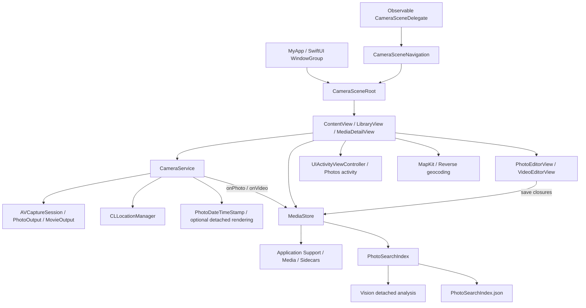

# Work Camera Technical Documentation

This document is based on the seven Swift source files, Xcode project/workspace, scheme management, and asset catalog inspected on 2026-10-01, with photo-save reliability, photo-processing performance, camera/Library orientation handoff, camera-to-Library entry, and diagnostic cleanup notes updated against current source on 2026-10-10, root-page quick-action routing, SwiftUI app lifecycle recovery, and build-number notes updated against current source on 2026-10-09, the optional photo date/time stamp updated on 2026-10-08, camera auto-lock behavior, original-file detail sharing, Library selection sharing, Back-button handling, and Collections cover thumbnails updated against current source on 2026-10-05 and Library presentation, grid thumbnail caching, and build-number updates grounded in current source on 2026-10-04. Historical memory, filenames, and UI labels are not treated as evidence of completed functionality. See the [README](README.md) for setup and usage.

Camera selection, app-controlled Auto Macro, Home Screen quick actions, direct Library navigation, privacy-manifest declarations, and related validation notes were updated on 2026-10-02 against current source and configuration. Other sections retain the original documentation scope.

## 1. System Overview and Evidence Categories

Work Camera has a single iPhone application target. The entry path is SwiftUI `MyApp`/`WindowGroup` → `CameraSceneRoot` → `CameraNavigationRoot` → `ContentView`. The observable scene delegate resolves its initial route before the root creates `ContentView`, which owns `CameraService` and `MediaStore`. Normal entry selects Camera; a Home Screen shortcut selects the requested Library tab. Captures are written to the app's Application Support directory. Library uses the same store, with editing callbacks, Report sidecars, and the system sharing UI for output.

| Status | Meaning and current evidence |
| --- | --- |
| **Implemented** | Source exists and is called by the normal UI/lifecycle; capture, Library, albums, search, editing, Reports, templates, Home Screen quick actions, sharing, and the Photos activity meet this definition |
| **Test-covered** | Corresponding automated tests exist, independently of whether they were run; no tests or test target were found, so there is no coverage to list |
| **Verified in this task** | Limited to the successful static checks in Section 12; does not establish an app build or runtime result |
| **Externally unverified** | Device capabilities, capture output, SDK type compatibility, location, MapKit, Photos, signing, receiving-app behavior, and the final quick-action ordering/navigation fixes remain unverified except for the specific user-supplied observations recorded in Section 12 |
| **Experimental / Inactive** | Remaining `favorite` keys/cleanup have no UI for creating or displaying favorites; root-level PNGs are not referenced by the AppIcon manifest |
| **Planned / Not implemented** | Recommendations in Section 15 have no completed implementation |

Location metadata, reverse geocoding, Photos export, and third-party sharing are integrated optional paths. Optional does not mean inactive. There is no mock, fixture, demo backend, or separate experimental runtime mode.

## 2. Architecture and Lifecycle



The composition root is the `@StateObject` ownership in `ContentView`. Library and detail views receive the store through `@ObservedObject`; the store owns the search index. There is no DI container or repository protocol layer. Camera closures return `Data` or a temporary MOV URL with `VideoCaptureDetails`. Editors write through synchronous or asynchronous throwing save closures. The video callback in `CameraService` references a DTO defined in `MediaStore.swift`, so capture and storage models are not fully decoupled.

`CameraService`, `MediaStore`, and `PhotoSearchIndex` are `@MainActor`, matching the project's default actor isolation. Capture session `startRunning`/`stopRunning` execute on the `WorkCamera.captureSession` serial queue; other session configuration mainly follows the service's MainActor path. Delegate callbacks are `nonisolated` and dispatch back to MainActor. Optional photo date/time rendering and HEIC encoding use a user-initiated detached task through the `nonisolated` `PhotoDateTimeStamp` helper. Vision analysis uses utility detached tasks. Thumbnail file work and image decoding run in `MediaThumbnailDiskCache`, while `MediaThumbnailCache` owns UI-facing results on MainActor. These tasks are not system background-processing jobs.

The camera Library button starts an orientation-coordinated navigation request, then cancels the countdown. The previous root page remains until the scene orientation and window dimensions match the target; publishing the Library route then closes camera control panels. A stable root container retains lifecycle ownership across destination switches, and its initial store-load task runs once. A root task keyed by `shouldKeepScreenAwake` starts capture only for an active camera route with resolved portrait layout, checking cancellation and the current route inside the task. Other states call `camera.stop()`. Returning to the active camera starts it again while preserving zoom; entering the background marks zoom for reset on the next start. Root disappearance also cancels the countdown, stops capture, and restores auto-lock. During recording, `stop()` updates wantsRunning/location state and then returns early without automatically ending recording. Background recording must not be treated as verified.

`CameraPreview` receives a closure capturing the shared scene navigation object. Both preview creation and updates read the current `libraryVisible` value before attaching the capture session or setting the preview device/rotation coordinator. Once Library is selected, these operations are skipped even if the outgoing camera host recreates a preview from an older view value. Returning to Camera allows the normal attachment path again. `CameraService.stop()` clears UI-facing readiness immediately and queues hardware-control cleanup and `stopRunning()` on the serial capture queue. Repeated stop requests are coalesced; UUID request guards reject obsolete queued starts/stops, and a new start awaits pending queue work before configuration.

`ContentView.shouldKeepScreenAwake` is true only when the scene navigation reports `.active`, `portraitCameraSize` is available, and `libraryVisible` is false. Scene delegate callbacks publish active/inactive/background transitions through `CameraSceneNavigation`. An `onChange` handler with `initial: true` assigns the value to `UIApplication.shared.isIdleTimerDisabled`; root disappearance and inactive/background delegate callbacks restore auto-lock. Photo and Video capture screens both stay awake, including idle preview. Library, Collections, Templates, and their detail/editor flows leave auto-lock enabled. This policy follows the root route and scene state rather than recording or capture-session state.

`MyApp` retains the SwiftUI `App` lifecycle using `@UIApplicationDelegateAdaptor` and `WindowGroup`. The app and scene delegates conform to `ObservableObject`; `CameraSceneRoot` reads its scene delegate from `@EnvironmentObject`, and `CameraNavigationRoot` observes `CameraSceneNavigation` directly. Its scene reader remains mounted before page construction and across destination switches. Cold shortcuts wait for resolved entry geometry before creating `ContentView`; there is no default camera page during this resolution. UIKit does not manually create the scene window or root hosting controller. `ContentView` is keyed by navigation identity, and its `@StateObject` camera/store ownership remains stable during ordinary page switches. The camera service object exists on a Library route, but its capture-start path and camera preview are not activated there. `ContentView` chooses between `NavigationStack`/`LibraryView` and the camera page; the old modal Library bridge remains removed. The fixed portrait camera host uses fixed bounds without counterrotation animation. Camera layout caches only nonzero portrait window dimensions and safe-area insets.

### 2.1 Home Screen Quick Actions

`CameraAppDelegate.application(_:didFinishLaunchingWithOptions:)` registers three dynamic `UIApplicationShortcutItem` values: `workcamera.open.library`, `workcamera.open.collections`, and `workcamera.open.templates`. Their titles are Library, Collections, and Templates, with matching SF Symbol icons. Dynamic registration requires launching the app once after installation or an update.

Cold-launch selection is read from `UIScene.ConnectionOptions.shortcutItem` in `CameraSceneDelegate.scene(_:willConnectTo:options:)`. The delegate creates `CameraSceneNavigation(initialAction:)`, attaches it to the scene, and then publishes it to the SwiftUI root. Scene configuration specifies only the delegate class, leaving scene/window creation to SwiftUI. Selection for an existing scene is received by `windowScene(_:performActionFor:completionHandler:)`, which calls the same navigation object's `openLibrary(action:)`. Each action produces a new UUID-tagged `CameraQuickActionRequest`; there is no shared request queue or camera-preview dependency. A new shortcut also cancels any pending return to Camera.

`LibraryView` initializes its tab from the request before its first render. `applyQuickAction()` applies each request UUID once, dismisses detail/template/share presentations, clears selection and album/filter/search scope, and loads saved templates when requested. Subsequent appearances do not reapply the same request.

Registration uses `CameraQuickAction.allCases.reversed()`, producing Templates → Collections → Library in the array. This responds to the user's observed reverse display order and targets Library → Collections → Templates at the tested icon position. The final visible order remains manually unverified. The app does not control the placement of iOS system actions such as Edit Home Screen, Require Face ID, or Remove App.

`CameraOrientationPolicy` stores supported masks by scene ID. Camera uses `.portrait`; a pending Library entry uses the exact interface direction resolved from handset orientation, then releases to `.allButUpsideDown` after completion. Device and interface landscape directions are opposite. Navigation owns balanced device-orientation notification generation so cold shortcuts do not depend on constructing a camera preview. Unknown readings stay unresolved; face-up/down readings can use a valid scene direction. Orientation updates target the SwiftUI-managed window root via `setNeedsUpdateOfSupportedInterfaceOrientations()` inside `UIView.performWithoutAnimation`; the normal path no longer calls `requestGeometryUpdate`. A pending route finishes only for a known, matching effective orientation and matching window aspect. The scene reader tracks orientation, safe-area insets, and window size. A new request supersedes the previous UUID and cancels its timeout. After three active seconds without completion, the request reports an error and restores support for the previous route instead of displaying the requested page in the wrong orientation. Inactive/background transitions cancel the timeout and retry pending updates on activation; disconnect cancels observation/tasks and removes scene policy. Preview uses the sensor-to-portrait angle; photos/videos use the capture coordinator’s horizon-level angle at shutter/recording start. Only button labels rotate with the handset during camera use. Native nonanimated orientation updates do not prove that the first Library frame appears correctly on every device.

The preview controller observes app/capture interruptions and runtime errors, covering stale frames with black. On foreground recovery, `CADisplayLink` waits up to three seconds for a running, uninterrupted session and a previewing layer. A timeout leaves the cover visible; a subsequent session-start or interruption-ended event retries. This protects preview presentation; it is not a complete session-reconstruction mechanism.

## 3. Project Structure and Core Components

| Source/configuration | Components and responsibilities |
| --- | --- |
| [MyApp.swift](Work%20Camera/MyApp.swift) | `MyApp`, `CameraSceneRoot`, `CameraNavigationRoot`, observable app/scene delegates, `CameraSceneNavigation`, `CameraQuickAction`, `CameraQuickActionRequest`, `CameraWindowSceneReader`, `CameraOrientationPolicy`, and fixed portrait camera hosting; SwiftUI startup, per-scene root routing, geometry, and orientation ownership |
| [ContentView.swift](Work%20Camera/ContentView.swift) | `ContentView`, `ExposureRuler`, `CameraGrid`, `LibraryView`, `MediaDetailView`, Reports/templates, Info summaries, thumbnails, playback/zoom UIKit bridges, share payload, and Photos activity |
| [CameraService.swift](Work%20Camera/CameraService.swift) | `CameraService`, capture/location delegates, `PhotoMetadataCustomizer`, `CameraPreview`, its controller, and layer view |
| [PhotoDateTimeStamp.swift](Work%20Camera/PhotoDateTimeStamp.swift) | `PhotoDateTimeStamp`; local shutter-request timestamp formatting, full-size orientation-normalized decoding, bottom-right text rendering, and HEIC encoding |
| [MediaStore.swift](Work%20Camera/MediaStore.swift) | `MediaItem`, `MediaAlbum`, `VideoCaptureDetails`, `MediaStore`, and storage errors |
| [MediaThumbnailCache.swift](Work%20Camera/MediaThumbnailCache.swift) | `MediaThumbnailCache`, `MediaThumbnailDiskCache`; memory entries, disk JPEG previews, preloading, and cleanup |
| [PhotoSearchIndex.swift](Work%20Camera/PhotoSearchIndex.swift) | `PhotoSearchRecord`, `PhotoSearchCache`, `PhotoSearchIndex`; Vision, search, and cache |
| [PhotoEditorView.swift](Work%20Camera/PhotoEditorView.swift) | `PhotoEditorView`, `CropSelection`, `MarkupCanvas`, `ResizingMarkupCanvas`, and HEIC encoder |
| [VideoEditorView.swift](Work%20Camera/VideoEditorView.swift) | `VideoEditorView`, scrub/trim/crop controls, video composition, and HEVC exporter |
| [project.pbxproj](Work%20Camera.xcodeproj/project.pbxproj) | One application target, Debug/Release configurations, synchronized file group, generated Info.plist, and signing settings |
| [Workspace](Work%20Camera.xcodeproj/project.xcworkspace/contents.xcworkspacedata) | A `self:` project reference, with no additional projects |
| [AppIcon manifest](Work%20Camera/Assets.xcassets/AppIcon.appiconset/Contents.json) | References `AppIcon-1024.png` in the same directory as an iOS universal 1024 × 1024 entry |

`PBXFileSystemSynchronizedRootGroup` points to `Work Camera`; source/resource build phases do not manually enumerate the Swift files. The frameworks phase has no third-party entries. The repository contains no tests, scripts, CI, package manifests, lockfiles, environment examples, or separate entitlement file.

## 4. Data Flow

### 4.1 Photo Capture

1. `ContentView` installs `onPhoto`/`onVideo` callbacks and starts the camera. The service requests camera and microphone permissions in sequence, using wantsRunning guards to prevent a cancelled start from continuing.
2. Initial configuration selects the physical back lens for 1×, rejects virtual camera inputs, and attaches photo output and an available audio input. Photo/video mode determines the preset and whether movie output is attached.
3. The shutter calls `takePhoto` directly or uses a countdown protected by a UUID guard. Leaving the active state, entering Library, or switching to video cancels the countdown.
4. The service checks ready/busy/recording state, the HEVC photo codec, and rotation support. It snapshots a valid location and requests the active format's maximum photo dimensions with `.quality` prioritization.
5. Immediately before requesting capture, the service snapshots `photoDateTimeText` from the supplied `dateTimeStampEnabled` option and the local date/time. The delegate obtains the HEIC file representation, applying the existing location metadata customizer when available. With the stamp disabled, the capture image and attachments follow the existing path. With it enabled, the delegate awaits detached full-resolution stamping before calling `onPhoto`. `isBusy` remains true until processing and the callback finish; `defer` clears the location, timestamp, and busy state on success or failure. Stamp failure reports an error and does not save an unstamped substitute.
6. `MediaStore.savePhoto` allocates a filename, atomically writes a staging file, and moves the completed file to its HEIC destination without replacing an existing capture. Deferred cleanup removes remaining staging data. The store reads dates for the new file, inserts it at the front of `items`, and reconciles search and thumbnail caches once. It no longer calls `load()` after each photo save, avoiding a full media-directory scan and duplicate reconciliation. It does not re-encode the capture as JPEG.
7. The camera Library button and its action guard reject entry during `isBusy`, recording, or countdown. This prevents that button from stopping the camera while photo processing or the synchronous save callback is still running. Capture processing and stamp errors include a stage and system error domain/code; missing file data has a specific message. Save errors distinguish destination preparation, temporary-file writing, and final file movement.

Maximum photo dimensions are selected by pixel count from the current `activeFormat.supportedMaxPhotoDimensions`. There is no algorithm that searches all formats to select 48 MP. Diagnostic-only enumeration of other high-resolution formats has been removed; dimension selection and `.quality` prioritization are unchanged.

### Photo Date and Time Stamp

Photo controls use a three-column grid, adding DATE & TIME alongside exposure, grid, and shutter sound. On/Off choices bind to `@AppStorage("photoDateTimeStampEnabled")`, defaulting to false. Both immediate and countdown shutter paths pass the option to `CameraService.takePhoto(shutterSoundEnabled:dateTimeStampEnabled:)`. The option and local timestamp are fixed at the capture request, so subsequent setting changes or processing delays do not change that photo's stamp. The time represents the app's shutter request, not a sensor exposure timestamp.

`PhotoDateTimeStamp.text(for:)` formats the date with an `en_US_POSIX` locale, Gregorian calendar, current time zone, and `yyyy-MM-dd HH:mm:ss`. `apply(to:text:)` uses ImageIO to decode the full image with EXIF rotation/mirroring applied, ignoring embedded thumbnails. The maximum decoding edge matches the source's maximum pixel dimension. A scale-1, opaque, standard-range `UIGraphicsImageRenderer` places white monospaced digits with a dark shadow at the bottom right. Font size is 3.2% and margin 2.5% of the short edge. Rotated captures may swap width and height while retaining their displayed pixel dimensions.

Output is HEIC with compression quality 1.0. EXIF, TIFF, GPS, and IPTC dictionaries are retained where available; pixel dimensions and orientation are updated, and EXIF MakerNote is removed. Orientation becomes 1 because it is baked into the pixels. Encoding finalization and the resulting HEIC type are checked before returning data. Re-encoding is not lossless capture preservation: HDR/gain maps and other auxiliary attachments are not copied, and the unstamped capture is not retained as a separate file. The stamp is permanent image content and survives the existing file-sharing and Photos-import paths. Device results remain unverified.

### 4.2 Video Recording

Video configuration first tries 4K/1080p 10-bit bi-planar HLG BT.2020 formats supporting 30 FPS, with HEVC. If none has a compatible codec, it tries 8-bit bi-planar sRGB SDR formats, ordered by 4K, 1080p, 720p, then remaining sizes by pixel count. SDR prefers HEVC and permits H.264. Every candidate uses `.inputPriority` and a fixed `1/30` frame duration, with codec availability re-evaluated after applying its format. Configuration state is invalidated before selection. Recording start checks the selected device, format, color space, codec availability, and rotation support; a stale or unsupported configuration gives an actionable error. These checks do not prove runtime camera or file compatibility.

`recordingCaptureDetails` snapshots the date, device hardware identifier, valid location, and available physical-lens details. Recording uses a physical camera input; camera/zoom switching is blocked while recording. The retained metadata guard omits lens/aperture/focalLength if given a virtual device, but the current capture-input paths reject such devices. Physical-camera focal length is the nominal 35 mm equivalent, without video crop/zoom calculations.

Movie output metadata includes make, model, an ISO 8601 date using the current time zone, and valid coordinates as an ISO 6709 string. It replaces only app-owned top-level identifiers and does not write Dolby Vision track metadata itself. MOV output is first generated in the temporary directory. The completion callback considers either a nil error or `AVErrorRecordingSuccessfullyFinishedKey == true` successful; only unsuccessful completion removes the temporary recording. A successful callback asks the store to write captureDetails to the INFO sidecar before moving the MOV into Media. A failed move attempts to remove the new sidecar. A saved movie is inserted into items even if reload fails. The UI save callback attempts to remove the temporary MOV on failure.

### 4.3 Library, Search, and Rendering

`load()` creates the Media directory and enumerates nonhidden regular files whose names exactly match `^IMG_[0-9]{4}\.(HEIC|MOV)$`. It sorts by filesystem creation date descending, reads modification dates, and reconciles the search index and thumbnail cache. Albums stay in memory after their first successful load. There is no filesystem watcher or cross-process synchronization.

Library filters by media type or album. Entering Search calls index `start`; subsequent store reloads, new photo insertion, and photo overwrites reconcile it. Photos display the full image with 1–5× UIKit scroll-view zoom. Left/right swipes navigate within the current photo list only at fitted scale, without wrapping at the ends. Bounds or image changes reset fitted zoom.

In selection mode, the bottom bar places Share on the left, the selected count in the center, and album/delete actions on the right. A 96-point left group balances the two 48-point actions on the right. The count uses one line with a minimum scale factor of 0.8. Share is disabled for an empty selection; album membership and deletion retain their existing behavior.

Library grid photo thumbnails use ImageIO with EXIF transformation and a maximum edge of 256 pixels. Grid video thumbnails use `AVAssetImageGenerator` at time zero, with the preferred track transform and a 256 × 256 maximum size. `MediaThumbnailDiskCache` writes JPEG previews at quality 0.85 under `Library/Caches/WorkCameraThumbnails/v1`. SHA-256 of the original file URL selects the item folder; a hash of creation/modification timestamps and file size selects the preview filename. These are disposable previews, not converted originals or a content-hash integrity check. Cache reads first check file existence; a miss or decode failure falls back to generation. Write failures do not fail media saves. Revision checks reject stale generated results, old revision JPEGs in the same rendition folder are removed after a successful write, and reconciliation removes folders for inactive items. The system may purge this cache.

Collections uses `CollectionThumbnail` for both collection and album covers. `MediaThumbnailSize.collection` requests a square pixel size computed from card width × SwiftUI `displayScale`, rounded up to a multiple of 128 and clamped to 256–2048. ImageIO pixel dimensions or asynchronously loaded video track dimensions and preferred transform determine the generation bounds. When dimensions are available, generation targets the requested short edge without upscaling the source; the result is center cropped to a square before JPEG encoding. Missing dimensions fall back to a maximum bounding box of the requested size, which can leave the cropped short edge below the target. Low-resolution originals cannot supply missing detail. Cover previews live in `collection-<pixels>` subfolders under the item folder, so existing grid JPEGs are never reused as covers or removed when writing a cover. The view's load identity includes the complete media item and rendition size, allowing reloads after media or layout changes.

`MediaThumbnailCache` shares pending loads and uses `NSCache` with an 80-entry count limit and a 32 MiB cost limit, charging decoded CGImage bytes. These limits are eviction guidance; SwiftUI-held entries and in-flight images also consume memory. Reconciliation preloads the first 40 items in memory, then prepares the remaining disk previews. Batch loading schedules up to four item tasks; the disk actor serializes synchronous decoding and file operations, while asynchronous video extraction can interleave.

Collection covers use a separate `NSCache` with a 16-entry count limit and a 32 MiB cost limit. Cover keys include the source URL and requested pixel size; entry validation also checks the media item and rendition. Pending loads are shared by item and rendition, keeping grid and cover generation distinct. Reconciliation clears cover memory entries when the item list changes; covers load on demand rather than participating in the 40-item grid preload. These additional cache limits do not cap total app memory, and generation can temporarily decode a larger rectangular image before cropping.

Library computes the initial batch from viewport height and five columns, including one extra row. If that batch is already cached, it displays immediately; otherwise gray tiles appear until the batch completes, then the grid is revealed together with animations disabled. Preparation completion does not guarantee that every entry contains a successfully generated image. Later cells load individually as needed. Preloading 40 items does not guarantee that every orientation or filter fits that batch. Cold startup, missing disk previews, cache eviction, and fast scrolling can still incur waiting. No zero-latency or large-library performance guarantee has been measured.

Video detail starts playback muted, updates the UI with a 0.25-second timer, and normally hides controls after three seconds. Seeking, modals, and errors delay hiding.

### 4.4 Reports, Info, and Sharing

Reports are saved atomically as UTF-8 TXT, normalizing CRLF/CR to LF. Video Caption and Report share the TXT sidecar without rewriting the MOV description. Keywords are saved in INFO JSON without rewriting MOV metadata. When no annotation sidecar is present, Info can display the movie's description/keywords as a fallback. An unchanged fallback is not a saved sidecar and is not guaranteed to appear in the shared Report.

Photo Info uses ImageIO to expand metadata and summaries. Video Info uses AVAsset/track metadata, formatDescriptions, size/transform, duration, and nominal frame rate, with sidecar fallback. When movie lens identity is present, it does not mix that identity with the sidecar's starting aperture/focal length. Missing values display Not provided. HDR classification uses the codec, `dvcC`/`dvvC` atoms, and transfer function to distinguish Dolby Vision, HLG, PQ, SDR, or unknown; it is not inferred from UI labels.

MapKit reverse geocoding resolves saved coordinates using the current locale. Requests are cancellable, and results must match the active request identity. Failures leave coordinates visible. There is no persistent address cache or retry/backoff.

Detail-view sharing first attempts to save the Report, then checks that the current media file exists. A missing file produces an Error alert and no share sheet opens. Both photos and videos use the current library file URL directly: HEIC photos are not converted to JPEG, and MOV videos retain their existing HEVC or H.264 encoding without share-time transcoding. A nonempty normalized Report is a separate activity item. This path creates no temporary sharing file. Receiving-app dimensions, captions, line breaks, transcoding, and metadata retention require external verification.

Library batch sharing calls `shareSelectedItems()`, selecting file URLs from `displayedItems` in display order using `selectedIDs`. Empty results do nothing; if any selected file is missing, the existing Error alert reports the failure and no share sheet opens. `LibrarySharePayload` snapshots the URLs, and `LibraryShareSheet` passes them to `UIActivityViewController` with no custom activities. This path sends current HEIC/MOV library files directly, creates no temporary JPEGs, and attaches no Reports. It does not use the detail view's custom Photos save activity or sidecar location handling. Receiver format support, system save behavior, and metadata retention remain unverified.

The custom `SaveOriginalMediaActivity` excludes the system `.saveToCameraRoll` action. After requesting `.addOnly`, it adds the current library file through `PHAssetCreationRequest.addResource`, with `shouldMoveFile = false`. Photo location comes from HEIC GPS; video location comes from the capture sidecar. It does not request the current location. If the file was previously overwritten, this “original” library file is the edited file, not an immutable capture backup.

## 5. Data Models, Persistence, and State

| Model/storage | Structure and boundaries |
| --- | --- |
| `MediaItem` | URL, kind, createdAt, modifiedAt; id is the filename, not a UUID; rebuilt from the filesystem on each load |
| `MediaAlbum` | UUID id, name, `Set<String>` memberKeys; stored in `Media/Albums.json` |
| `VideoCaptureDetails` | Codable date, device, optional lens/focal length/aperture/coordinates; stored in INFO's `captureDetails` field |
| `<stem>.INFO.json` | JSON dictionary that may contain captureDetails/keywords; keyword writes preserve unknown fields and do not overwrite malformed JSON |
| `<stem>.TXT` | Report/video Caption, UTF-8, LF line endings |
| `PhotoSearchCache` | `PhotoSearchIndex.json` at the Application Support root, `version = 1`, records keyed by filename |
| `PhotoSearchRecord` | fingerprint, OCR text, labels, complete; partial results can be retained |
| `ReportTemplate` | UUID, name, content; a Codable array in UserDefaults `reportTemplates.v1` |
| UserDefaults | `nextCaptureNumber`, `shutterSoundEnabled`, `photoDateTimeStampEnabled` (false by default); also residual cleanup for `favorite.<filename>.<creation timestamp>` |
| View state | Selection, filter, player, editor/share/Info/Report modals, and annotation drafts mainly use SwiftUI `@State`; no centralized reducer |

Media lives in `FileManager`'s Application Support directory under `Media`; temporary MOV files used for recording and video editing use the system temporary directory; sharing uses current library file URLs. There is no database, Keychain, cloud container, or sync adapter. Media/Albums/INFO have no schema version or migration runner. The template key and search cache have v1 markers but no upgrade migration. Undecodable or incompatible search caches are ignored and rebuilt. Initial cache-read failures do not set cacheError; persistence failures produce a UI warning.

Album member keys combine the filename and filesystem creation timestamp to avoid inheriting old membership after normal filename reuse. This depends on stable creation dates; it is not a content hash or immutable capture ID.

## 6. Important Logic

### Filenames, Albums, and Deletion

The allocator starts at the next number in UserDefaults and cycles through 1–9999, checking at most 9,999 slots. A matching HEIC, MOV, TXT, or INFO.json with the same stem occupies a slot. Finding a slot immediately advances the counter, so a failed write can still advance it. This is not a cross-process lock. The loader regex can also accept `IMG_0000`, although the allocator never generates it.

Album names are trimmed and reject empty names, case-insensitive duplicates, and the reserved name `Not in an Album`. Media can belong to multiple albums. Unassigned items are the complement of all memberKeys, not a separately persisted album. Delete Album Only keeps media; deleting an album with its media removes the files and their membership in other albums.

Single-item deletion removes media first, then independently attempts album persistence, Report deletion, INFO deletion, and directory refresh. A failure in one cleanup step does not skip the others; failures are collected in an incomplete-deletion error. A defer removes deleted media from items and reconciles the index. Reconciliation loads and purges persisted OCR even before Search is opened, while Vision jobs remain gated until Search starts. Unreadable/unsupported caches are preserved with an error, and failed cache writes remain pending for a later reconciliation. Multi-file deletion is not transactional: filesystem failures can still leave partial changes or orphaned data, and a batch stops on its first thrown item error. There is no trash or rollback.

### Zoom, Macro, Exposure, and Location

Preview, photos, and videos use physical camera inputs only. `backCameraLensMetadata` prefers triple, dual-wide, dual, then wide devices solely to read lens/zoom metadata. Virtual constituent devices are filtered out of `physicalBackLenses`. Initial configuration rejects a virtual device before creating its input; `replaceVideoInput` rejects one before changing the session and reports "Virtual cameras are not allowed." Back-zoom application, the photo shutter, and recording start also reject virtual devices. No virtual-camera autofocus or recording switch-over policy is enabled.

Constituent switch-over factors multiplied by the display multiplier map physical lenses to baseZoom. If virtual metadata is unavailable, the fallback lists available physical ultra-wide and wide cameras at 0.5× and 1×. Normal zoom selection uses the last lens with baseZoom no greater than the UI factor (with a 0.01 tolerance), falling back to the first lens; device zoom is factor/baseZoom, clamped to its range. Shortcuts include physical-lens base factors and 1/2, optionally ultra-wide 0.5 and an 8× crop when a 4× telephoto is present, then are filtered, deduplicated, and sorted. These shortcuts do not all represent optical magnification. An active Auto Macro override selects the physical ultra-wide lens at the requested zoom only if its device-zoom range supports that factor.

App-controlled Auto Macro defaults to enabled. `isMacroAvailable` requires a back camera and a physical ultra-wide lens supporting continuous autofocus with minimumFocusDistance in `(0, 100]`. The existing macro button toggles it; disabling restores the normal physical lens for the current zoom. Manual zoom selection clears the macro override and begins a cooldown. The 0.5× shortcut is manual ultra-wide selection, with no automatic return to a different lens. Continuous autofocus remains enabled on the selected physical lens.

`startAutoMacroMonitoring` runs a MainActor task with weak service capture, sampling every 250 ms after session start; `stop()` cancels it, and service deinitialization also cancels the task. Monitoring requires the app to be active, a ready/running back-camera session, Auto Macro enabled, zoom at least 1×, compatible ultra-wide zoom, no photo processing or recording, and settled continuous autofocus. It resets pending decisions when these conditions are not met; a sample gap longer than 0.5 seconds restarts the dwell period. Starting/resuming, input changes, mode changes, manual zoom, toggling, and automatic switching impose a 2-second cooldown. Library return retains the current input/zoom; the existing background-reset policy clears the override when zoom resets to 1×.

Entry requires the normal physical lens's `lensPosition` to remain at or below `0.12` across eligible samples for at least 0.75 seconds. On the physical ultra-wide input, eligible autofocus readings track a stable candidate during the 2-second switching cooldown. The candidate restarts when the reading differs by more than `0.02` or the sample gap exceeds 0.5 seconds. Startup completes only after cooldown and at least one continuous second within that candidate window. During startup the ultra-wide input stays fixed and no exit baseline exists. The app then establishes the baseline as the average of the candidate and current readings, regardless of the initial autofocus travel.

After startup, candidate windows lasting at least 0.5 seconds can only lower the established baseline during the same macro-lens session, so it does not follow a subject moving farther away. Exit requires the current position to remain at or above `min(baseline + 0.04, 0.80)` for at least 1.25 seconds, then restores the normal physical lens for the retained zoom. The `0.80` upper bound is an empirical value from the supplied device traces and applies to every supported macro zoom and lighting condition. It prevents a high startup baseline from pushing the threshold above the observed distant readings; close readings reaching this cap can also cause unwanted exit. This replaces the former fixed `0.85` exit requirement. There is no acquisition-anchor invalidation or normal-lens recheck: automatic decisions are only `.enter` and `.exit`. Initial focus movement cannot itself authorize replacement.

Input changes clear startup state and the baseline. Library stop/resume retains the established baseline for the same input but discards unfinished learning samples. Focus adjustment or other ineligible states reset pending dwell and baseline candidates, without discarding an established baseline. Explicit mode/zoom/camera/macro controls retain their existing episode resets and cooldowns; background zoom reset clears the override. All automatic decisions retain the active-session, photo-processing, recording, physical-input, and supported-zoom guards.

These are uncalibrated focus heuristics. Apple documents `0` as the near end and `1` as the far end, but values are not precise distances and do not represent the same distance across lenses ([lensPosition documentation](https://developer.apple.com/documentation/avfoundation/avcapturedevice/lensposition)). Comparing changes on the same ultra-wide lens still cannot prove subject distance. Startup autofocus convergence and immediate subject withdrawal can produce similar readings: moving away before baseline establishment may seed a distant baseline. The `0.80` exit cap limits the resulting threshold but cannot distinguish a stationary close subject whose focus readings also reach that value. Removing the probe eliminates that preview-changing fallback, but does not guarantee stationary stability against later focus drift. An unchanged focus reading, low light, autofocus failure, and low-detail scenes can still cause missed or unwanted transitions; settled readings do not prove successful focus. Actual thresholds and stability need device validation. A failed switch attempts to restore the previous physical selection, then cools down; it never falls back to a virtual device. Recording freezes the selected physical lens; automatic selection is available in video preview before recording starts.

Exposure compensation is clamped to the hardware range within at most −2…+2 EV. The ruler rounds to 0.1 EV; photo/video modes retain separate biases. Torch is used only in video mode. When camera controls are disabled, the code attempts to turn torch off and clear device exposure bias. Shutter sound suppression is set only when the output reports support.

Location updates occur only while wantsRunning and camera authorization are true. Capture snapshots require a timestamp no more than 30 seconds old and not in the future, nonnegative finite horizontalAccuracy, and valid coordinates. There is no additional accuracy threshold. Photo GPS dates/times use UTC. EXIF capture wall-clock display does not assume a missing time zone. Movie creation dates use ISO 8601 with the current time zone; UI dates generally use the current locale. These sources do not form a unified timeline in a fixed time zone.

### Search Algorithm

The fingerprint is `filename|creation timestamp|modification timestamp`. Reconciliation removes mismatched cache entries and prunes failed fingerprints. At most one worker analyzes photos sequentially, with each Vision job in a utility detached task. There is no warm-up or media-content-hash deduplication.

Analysis starts with an EXIF-transformed thumbnail whose maximum edge is 2560 pixels, then separately performs accurate OCR, image classification, and document segmentation. OCR enables language correction and automatic language detection, preferring supported `zh-Hant`, `zh-Hans`, and `en-US`. Classification keeps the first 20 observations with confidence ≥ 0.2 and adds hardcoded Chinese/English aliases. Document results with confidence ≥ 0.5 add document/paper labels.

Each of the three requests has separate error handling. At least one successful request preserves a partial record; all three must succeed for complete status. Failed fingerprints are skipped in the current attempt; user Retry clears the failure set. There is no unlimited automatic retry or backoff. Results returned to MainActor are checked against the current item/fingerprint to reject stale results for edited, deleted, or reused files.

Query normalization uses POSIX locale folding for case, diacritics, and width, and replaces underscores with spaces. Whitespace-separated terms must all be substrings of the searchable string. That string contains only the filename and valid photo OCR/labels, excluding Reports, Captions, Keywords, and addresses. Chinese object aliases are a limited collection, not general semantic translation.

## 7. Editing and Output Ownership

The photo editor first normalizes the image through an opaque scale-1 renderer. PencilKit drawing is projected from canvas bounds onto the image. Rotation or applied cropping flattens annotations and resets the drawing. Crop corners enforce a minimum of 5% per dimension. Canvas resizing transforms the drawing to preserve relative annotation positions.

The HEIC encoder preserves original EXIF/TIFF/GPS dictionaries, updates dimensions and orientation, removes EXIF MakerNote, and uses quality 1.0. Re-rendering/re-encoding is not guaranteed lossless. The store validates a complete single-image HEIC before overwriting or adding it. Overwrite uses an atomic write, restores creation date on a best-effort basis, and updates modifiedAt/index. A new copy uses `savePhoto` without copying text sidecars or album membership.

The video editor reads the first video track, duration, naturalSize, preferredTransform, and frame duration. Minimum trim length is `min(duration, max(frameDuration, 0.1 seconds))`; selection uses a timescale of 60,000. Composition normalizes track orientation, then applies quarter-turn rotation and cropping. Each output dimension is `max(2, floor(dimension × selectedFraction / 2) × 2)` to produce even dimensions.

Scrubbing displays decoded frames up to 720 × 720. A single in-flight seek retains the newest pending target. During dragging, time tolerance is at most 0.1 seconds; drag completion performs a zero-tolerance player seek. `seekGeneration`, task cancellation, cancelPendingSeeks, and generator cancellation prevent old work from affecting a new preview. Individual decode failures among the eight timeline thumbnails leave placeholders.

Export uses `AVMutableComposition`, `AVAssetExportPresetHEVCHighestQuality`, and MOV, copying asset top-level metadata. When keeping audio, each track's overlap with the trim selection is aligned to the output start. There are no explicit HDR color properties or Dolby Vision preservation settings, so HDR/Dolby Vision preservation after editing cannot be claimed. The editor cleans temporary export files in defer and releases its reader before commit. Save failure attempts to restore the playback item.

The store asynchronously validates positive duration and a video track, then rechecks that the source exists after suspension. Overwrite replaces the original with a staged MOV and keeps sidecars. A new copy first validates existing INFO, copies INFO/TXT, then publishes the movie through a hard link. Failure cleans up copied sidecars. New items initially use `Date()` without an immediate `load()`, so a later reload can produce different filesystem dates. Original album membership is not copied.

## 8. External Dependencies

| Framework/system API | Purpose | Status/version |
| --- | --- | --- |
| SwiftUI, UIKit, Combine, Foundation | UI, state, bridges, timers, files/JSON/UserDefaults | Required; provided by the Xcode SDK, with no pinned framework versions |
| AVFoundation, AVKit, CoreVideo | Capture, metadata, playback, 10-bit format detection, composition/export | Required; capabilities depend on SDK, OS, and hardware |
| ImageIO, UniformTypeIdentifiers | HEIC metadata, thumbnails, validation, and encoding | Required |
| Vision | Local OCR, classification, and document segmentation | Required for search; recognition results need device validation |
| PencilKit | Photo markup | Required for photo editing |
| CoreLocation | Optional capture location | Permissions and location availability unverified |
| MapKit | Optional coordinate maps and reverse geocoding | Apple system APIs; external service behavior unverified |
| Photos | Optional addition of library files to system Photos | Requires add-only authorization and successful system import |
| Darwin | `uname` for hardware identifiers | System-provided; names resolved through a local mapping |

`CryptoKit` supplies SHA-256 for local thumbnail cache keys. No third-party package, HTTP provider adapter, custom endpoint, or unofficial API was found. The DeviceKit URL in `MediaStore.swift` is a data-source comment, not a runtime network request or installed dependency. Mapping completeness and source licensing were not externally checked; unknown identifiers retain their original names.

## 9. Configuration

The only application target is `Work Camera`. Its legacy productName is `MyApp`, but `PRODUCT_NAME = $(TARGET_NAME)` and the product reference is `Work Camera.app`. There are no additional or test targets. Debug/Release target settings consistently specify iPhone, iOS/Simulator platforms, and disabled Mac Catalyst support. The project-level iOS deployment target is `27.0`. Remaining deployment values for other operating systems do not expand supported platforms.

Marketing version is `1.1.1` and build number is `20261009` in both target configurations. Settings include `SDKROOT = auto`, `SWIFT_VERSION = 5.0`, `SWIFT_APPROACHABLE_CONCURRENCY = YES`, `SWIFT_DEFAULT_ACTOR_ISOLATION = MainActor`, member import visibility, and generated localization strings. Debug enables testability and `-Onone`. Release uses whole-module compilation and disables assertions. There is no pinned compiler, minimum Xcode/host macOS version, or tool-version file.

Info.plist is generated from build settings with display name Work Camera. It includes camera, microphone, location when-in-use, and Photos add usage descriptions; scene/launch generation; and four interface orientations. There is no separate Info.plist or entitlements file. [PrivacyInfo.xcprivacy](Work%20Camera/PrivacyInfo.xcprivacy) is present in the target's filesystem-synchronized source folder; archive resource inclusion remains manually unverified. Settings such as `ENABLE_APP_SANDBOX` and `REGISTER_APP_GROUPS` exist, but no entitlement file establishes an App Group identifier or corresponding runtime use. App Groups functionality cannot be claimed as complete.

Signing is Automatic with a specific Team and bundle identifier. No private keys, certificates, provisioning profiles, or signing setup script are included. Documentation does not reproduce the Team value or credentials. Developers must select usable signing settings for physical devices.

Scheme management records `MyApp.xcscheme_^#shared#^_` and `Work Camera.xcscheme_^#shared#^_`, but the repository contains no `.xcscheme` definition. These records do not establish a shared scheme usable by CLI/CI. This task did not query schemes with `xcodebuild` or generate one.

There are no app-defined environment variables, API keys, feature flag files, or backend configuration. `DEBUG` is a build compilation condition; temporary photo diagnostic prints and timing probes have been removed. Shutter sound preference uses UserDefaults; grid, timer, and camera controls mostly use transient view state.

## 10. Error Handling and Logging

- `CameraError` covers a missing back camera or session configuration failure. Other format, orientation, permission, and device-lock errors are surfaced through the service's `errorMessage`.
- `MediaStoreError` covers exhausted filename slots, invalid edited media, missing captures/albums, invalid INFO, and invalid album names. Writes preserve malformed INFO. Some read APIs use `try?` with empty fallbacks, so the UI cannot always distinguish missing and corrupt data.
- Editors present localized alerts. Individual thumbnail, geocoding, and partial metadata failures retain usable results or placeholders. There is no unified error logger.
- Report template decode failures show an error. Template persistence has no general transaction/rollback abstraction. Successful UserDefaults encoding does not establish verified disk persistence.
- Local writes commonly use atomic operations or staging, but media/sidecars/albums do not form a multi-file transaction. Initial session configuration failure also lacks complete cleanup/reconstruction and needs manual fault validation.
- Explicit stale-work guards include wantsRunning, countdown UUIDs, Vision fingerprints, movie Info URL/cancellation checks, geocoding request identity, and video seek generations. Not every asynchronous read has equivalent identity/version protection.
- There is no global retry/backoff/rate limiter. Vision manual Retry and preview-event retries are specific paths. There is no offline queue or background task scheduler.

Temporary photo capture/configuration/timing/save console prints, diagnostic-only high-resolution format enumeration, image-property reads, and timing state have been removed. Capture, stamp, and save failures retain stage-specific user-facing messages and system error domain/code where available. Temporary `[WorkCamera Macro]` prints, the periodic focus-log helper, and diagnostic-only timestamps were also removed in an earlier revision. Autofocus monitoring, startup convergence, baseline learning, thresholds, dwell periods, cooldowns, and capture/recording guards remain active. Historical readings in Section 12 came from diagnostic-enabled revisions. There is no OSLog subsystem, log rotation, telemetry exporter, or formal secure logging system.

## 11. Security and Privacy

The Privacy Manifest declares `NSPrivacyTracking = false`, empty tracking domains, and an empty collected-data list for the current implementation, which has no developer-operated data collection or tracking SDK. Local processing is distinct from developer collection; Apple services, user-directed sharing, Photos, and backups retain the boundaries described below. Required-reason declarations are `NSPrivacyAccessedAPICategoryUserDefaults` / `CA92.1` for app-only preferences, templates, and numbering; `NSPrivacyAccessedAPICategoryFileTimestamp` / `C617.1` for app-container media ordering and search invalidation; and `NSPrivacyAccessedAPICategorySystemBootTime` / `35F9.1` for in-app elapsed-time calculations. These declarations do not replace the privacy policy or App Store Connect questionnaire. Static plist/schema checks do not establish acceptance by Apple or inclusion in an archived product; manually inspect the archive's app bundle for `PrivacyInfo.xcprivacy` before uploading.

[PRIVACY_POLICY.md](PRIVACY_POLICY.md) is the English privacy-policy source, last updated October 2, 2026. It identifies Sunny Yu and the public contact email and describes the implemented local storage, Vision search, permission, MapKit, sharing, Photos, backup, and deletion boundaries. The document is not a Privacy Manifest and is not connected to an in-app policy screen or link. Its publicly accessible HTTPS URL must be verified separately before use in App Store Connect; repository publication alone does not establish that verification.

Camera authorization is required before capture. Denied microphone permission can omit audio input during initial configuration; the source does not automatically rebuild an already configured session's audio input after permission changes. Location requests when-in-use permission and clears the latest fix on denial/failure. Photos uses add-only access in the save activity without reading the user's system library.

Media, GPS, Reports, Keywords, and OCR text are stored in local sandbox files/UserDefaults. There is no app-defined encryption, explicit file-protection attribute, Keychain, database protection policy, or backup-exclusion setting. System backups cannot be assumed disabled, nor can data be guaranteed to stay on the device. Photos import, system/user backups, and user sharing have separate external data boundaries.

Info's MapKit/reverse-geocoding path uses saved coordinates and can invoke system external services. Vision analysis has no app-defined upload API. There is no custom authentication, token store, TLS/certificate pinning, WebView, App Attest, APNs, or cloud-sync implementation. These mechanisms are not implemented for the currently absent backend paths.

Detail-view and Library batch sharing send the current HEIC/MOV files directly, which can retain embedded capture metadata. No metadata scrubbing is performed by the sharing path. Photos file imports can also retain capture metadata; Reports are separate sharing items in the detail view only. There is no location/text redaction UI or sensitive-content scan before sharing. Permission dialogs, external transfers, and device results were not verified in this task.

## 12. Testing and Validation in This Task

**2026-10-10 photo-save reliability, performance, and diagnostic cleanup**: Added a busy-state Library-button/action guard, replaced photo-save hard linking with a completed staging-file move, and added stage-specific error messages with system domain/code. New photo saves insert the file directly into the in-memory library and reconcile search/thumbnail caches once, avoiding a full directory reload. The user reported faster processing on a device before diagnostic cleanup; no numerical timings or device/configuration details were supplied, so this is limited qualitative evidence. Temporary capture/save timing probes, photo diagnostics, format enumeration, and diagnostic image-property reads were subsequently removed. Swift syntax parsing and `git diff --check` passed for the cleanup. Capture quality, maximum-dimension selection, and date/time stamp settings are unchanged. No agent-run Build/Test, simulator, or device validation was performed; the developer will perform Build/Test manually. Manually check the final cleanup with stamp On/Off, immediate/countdown capture, rapid Library-button attempts, large libraries, relaunch persistence, and file-write/move failures. The user-reported speed improvement does not establish resolution of every original error scenario.

**2026-10-10 camera/Library orientation handoff**: Camera uses a portrait-only scene policy; entering Library selects an exact handset-derived interface direction and applies UIKit’s nonanimated supported-orientation update. The previous page remains until effective orientation and window aspect match, then Library allows normal rotation. Returning to Camera waits for matching portrait geometry. Cold shortcuts resolve direction before constructing their requested page, with navigation-owned orientation notifications and an observed readiness gate. Removed the camera counterrotation animation. The user confirmed that the upper/lower black areas no longer briefly rotate; this is the only newly confirmed device outcome. Swift syntax parsing and `git diff --check` passed. These checks do not establish SDK type compatibility or first-frame visual behavior. Build/Test, simulator validation, and device installation were not run by the agent; the developer will perform them manually. Check Library first-frame appearance in both landscape directions, cold/background shortcuts, repeated entry/return, rapid route reversals, orientation lock, the three-second failure path, and preview/capture resumption. Earlier entry-delay timing evidence predates this handoff and is not a measurement of the revised route.

**2026-10-10 camera-to-Library entry and diagnostic cleanup**: Supplied entry timings showed Library initialization/layout within about 30 ms and background camera shutdown within about 182 ms, while main-queue work waited about nine seconds. The paused Thread 1 stack showed `CameraPreview.makeUIViewController` calling `AVCaptureVideoPreviewLayer.setSession`, then capture graph construction and an AVFoundation wait on the main thread. Added a live-route guard to preview creation/update so the outgoing camera preview cannot attach the session after Library is selected. The user rebuilt/ran the fix and reported that the delay was eliminated; this confirms the reported entry scenario only. Temporary LibraryEntry logging, main-queue timing probes, display-link presentation probes, and diagnostic-only lifecycle overrides were subsequently removed. The production preview-recovery display link remains. Debug/non-Debug Swift syntax parsing and `git diff --check` passed after cleanup. The cleanup itself has static validation only; no agent-run Build/Test, simulator validation, or device installation was performed. Manually verify the final cleanup, repeated Library entry/return, resumed preview and capture, background/foreground transitions, and Home Screen quick actions.

**2026-10-09 root routing and SwiftUI lifecycle update**: Library/Collections/Templates now use root-page switching, with the initial action resolved by the scene delegate before `ContentView` is created. Removed the UIKit full-screen Library bridge and retained portrait-confirmed return, UUID-guarded error recovery, scene-bound orientation, and camera/idle-timer lifecycle handling. The user reported a camera-page flash during shortcuts and then `Thread 1: Fatal error: Missing AppGraph` after an intermediate UIKit-entry migration. The final source restores SwiftUI `MyApp`/`WindowGroup`, observable scene-delegate environment access, and SwiftUI-managed window creation. Without a crash stack or a follow-up run, the exact fatal-error cause and successful recovery are not confirmed. Swift syntax parsing, focused source checks for SwiftUI startup/root routing/portrait return, and `git diff --check` passed. Syntax and source checks do not establish SDK type compatibility or runtime correctness. Current Debug/Release settings both use build `20261009`. Build/Test, simulator validation, and device installation were not run; the developer will perform them manually. Check normal startup and permission prompts, all three actions from cold launch and background, actions while Library/detail/template/share UI is open, repeated portrait/landscape returns, rotation-request rejection, camera capture/resumption, background zoom reset, auto-lock, and absence of the reported crash or camera-page flash. System launch/resume snapshots and final shortcut ordering remain device checks.

**2026-10-08 photo date/time stamp update**: Added a persistent photo-mode DATE & TIME control, shutter-request timestamp snapshots for immediate/countdown capture, and background full-resolution rendering/HEIC encoding. Swift syntax parsing, focused static checks for both shutter paths and option wiring, and `git diff --check` passed. Syntax parsing establishes neither SDK type compatibility nor runtime correctness. Build/Test, simulator validation, and device installation were not run; the developer will perform them manually. Check default Off and persistence after relaunch, On/Off capture, countdown timing, front/back cameras, portrait/both landscape orientations, readable placement on bright/dark backgrounds, saved dimensions and metadata, shared/Photos-imported output, and high-resolution processing responsiveness.

**2026-10-05 camera auto-lock update**: Added foreground capture-screen idle-timer control in `ContentView.swift`. `swiftc -frontend -parse` and `git diff --check` passed. These checks establish syntax and whitespace validity only; SDK type compatibility and device behavior remain unverified. Build/Test and simulator validation were not run. Manually verify idle Photo/Video previews beyond the configured auto-lock interval, Library entry and return, cold quick-action launches into Library/Collections/Templates, and inactive/background transitions followed by camera resumption.

**2026-10-05 Collections cover update**: The user reported an unclear Video cover. Source inspection found the same 256-pixel grid preview used on the larger square Collections card. Collections and album covers now request independent previews based on card width and display scale, with short-edge sizing and center cropping. Grid resolution, 40-item preloading, and the 80-entry grid memory limit are unchanged. `swiftc -frontend -parse` succeeded for `ContentView.swift` and `MediaThumbnailCache.swift`, and `git diff --check` passed. These checks establish syntax and whitespace validity only, not SDK type compatibility or visual improvement. No Build/Test, simulator validation, or device installation was performed. Manually verify landscape and portrait video covers, photo and album covers, reopening with an existing grid cache, rotation and media edits, cold-load timing, and memory use in Xcode and on device.

**2026-10-05 original-file detail sharing update**: Removed detail-view JPEG generation and temporary-file cleanup. Detail sharing now passes the current HEIC/MOV file URL with the existing optional Report, matching Library sharing's original-file payload approach. The user reported that a HEIC photo and message displayed correctly in a WhatsApp test described as Library selection sharing. Current Library selection source attaches only file URLs, so the source of that test's message was not established; this report does not verify the newly changed detail path or every receiver. `git diff --check` passed for the code change. No Build/Test or agent-run WhatsApp/device validation was performed. Manually verify detail-view HEIC sharing with and without a Report, MOV sharing, missing-file errors, and custom Save Image/Save Video actions.

**2026-10-05 Library selection sharing update**: Added a bottom-left Share button and centered selection count while retaining album and delete actions. `swiftc -frontend -parse` succeeded for `ContentView.swift`, and `git diff --check` passed. These checks establish syntax and whitespace validity only. No Build/Test, simulator validation, or device sharing was performed. Manually verify count alignment, empty/single/multiple selections, photo/video/mixed sharing, missing-file errors, sheet dismissal, and album/delete actions in Xcode and on device.

**2026-10-05 Library Back-button update (historical modal implementation, superseded by the 2026-10-09 root route)**: The user reported no response when returning from Library to Camera in either portrait or landscape, with no Error shown. That revision sent the dismissal request directly to the UIKit presentation controller while synchronizing SwiftUI presentation state. The existing portrait-restoration, geometry-error recovery, and camera-resume paths remain in place. `swiftc -frontend -parse` succeeded for `ContentView.swift` and `MyApp.swift`, and `git diff --check` passed. These checks establish syntax and whitespace validity only; they do not confirm the suspected state-delivery cause or device behavior. No application Build/Test or simulator validation was performed. Manually verify portrait and landscape returns, camera preview resumption with preserved zoom, repeated Library entry/exit, and Home Screen quick-action returns.

**2026-10-04 Library and thumbnail updates (Library presentation superseded on 2026-10-09)**: That revision documented UIKit-owned Library presentation, portrait restoration, disk JPEG caching, 40-item preloading, and an 80-entry memory count limit. The user reported that thumbnails no longer appeared one by one. After adding a file-existence guard before ImageIO cache reads, the supplied follow-up console log contained no missing-thumbnail-file errors; this is evidence for that recorded run only. The same log retained system `Fig`, `PointerUI`, handler, and linguistic-asset diagnostics, without an explicit crash or termination record. Their presence alone does not establish an app defect or a complete runtime pass. Syntax parsing and whitespace checks were performed; no agent-run Build/Test, device installation, or simulator validation was performed. Large-library rapid scrolling, memory use, cold-start timing, cache purging, rotation, and final quick-action behavior remain manual checks.

There is no XCTest/Swift Testing source, test target, test scheme, fixture, offline test suite, or CI. `ENABLE_TESTABILITY` does not establish tests. **Test-covered: no repository evidence to list.**

**2026-10-02 quick-action and documentation updates (historical routing)**: Source inspection at that time confirmed dynamic registration, separate cold-launch/existing-scene handlers, per-scene queued requests, direct root-page switching, initial tab selection, and reversed registration order. `swiftc -frontend -parse` succeeded for `MyApp.swift` and `ContentView.swift`, and `git diff --check` passed. Documentation was checked against those call paths. Syntax parsing does not establish SDK/API type compatibility or runtime correctness. The user reported a brief camera page during shortcut navigation and Templates → Collections → Library on screen before the respective fixes; there is no supplied device confirmation of either final fix. Manually check each action from cold launch and background, switching while Library/detail/template UI is open, returning to Camera, orientation, preserved zoom, and the visible order at the intended Home Screen icon position. Privacy-manifest plist syntax is checked separately; archive inclusion and submission acceptance remain unverified.

**Verified during the original documentation revision** was limited to:

1. Read-only cross-checking of source call paths and build settings during initial document creation.
2. Successful `git diff --check`; no whitespace errors in the existing working-directory diff.
3. Successful `plutil -lint` checks of project.pbxproj and the existing scheme-management plist.
4. Successful Python standard-library parsing of asset `Contents.json` files and workspace XML, and confirmation that the AppIcon manifest references an existing file.
5. Checks of completed documents for code fences, relative file links, source symbols/paths, consistent settings and feature descriptions, sensitive values/personal absolute paths, and Git change scope. SHA-256 comparisons during initial creation confirmed source, configuration, and asset preservation. The only observed difference was `UserInterfaceState.xcuserstate` in workspace user data; this task did not write or restore that IDE UI state file.

The English translation retains the original technical scope and evidence distinctions. Document checks and non-document file hash comparisons are repeated after translation; the initial source investigation is not represented as a new build or runtime validation.

**2026-10-02 camera updates**: The first revision prohibited virtual inputs and disabled Auto Macro. The current revision restores app-controlled Auto Macro while retaining physical-only inputs. Source inspection covers virtual-input guards, monitoring lifecycle, focus/dwell/cooldown decisions, manual controls, and capture/recording guards. Syntax-only parsing of `CameraService.swift`, whitespace/document checks, and SHA-256 comparisons of files outside the approved scope were performed. These checks do not establish SDK type compatibility or device behavior. The first syntax check's Swift launcher emitted Xcode tool-path/cache diagnostics during tool discovery; the current revision invokes the toolchain compiler directly for syntax parsing. No app build or test was requested or performed.

The user reported successful close-subject entry but no automatic exit when moving away. The follow-up revision replaces the absolute exit threshold with a learned ultra-wide focus baseline and adds focus diagnostics. The user subsequently supplied a successful 1× near-to-far run with the `+0.10` increment: the camera switched from Back Camera to Back Ultra Wide Camera, retained 1×, and returned to Back Camera at lensPosition `0.827451` with a logged baseline of `0.727` and threshold of `0.827`. This verifies that recorded run, not every lighting condition or zoom. The same syntax, whitespace/document, and out-of-scope file-preservation checks apply.

The following low-light 1× run entered macro but did not exit. Its logged baseline remained `0.753` and threshold `0.853`, while distant samples stayed around `0.808–0.827` with adjustingFocus and cooldown both false. The `+0.10` increment therefore prevented the observed samples from meeting the exit condition. The subsequent threshold-only revision changed the exit increment to `+0.04`, giving that example a threshold of `0.793`; entry, 1.25-second exit dwell, 2-second cooldown, capture/recording guards, and physical-only inputs remain unchanged. This increment applies to all lighting conditions. The lower increment makes exit more sensitive to focus changes. That threshold-only revision required both low-light and the previously successful 1× scenario to be retested.

The user then reported another low-light 1× failure with `+0.04` and confirmed immediate withdrawal as soon as macro activated. Logs showed `0.667 → 0.761 → 0.816`, a late baseline `0.802`, threshold `0.842`, and later readings around `0.815–0.827`. The acquisition loop discarded early candidates while readings rose, then seeded the baseline from a later plateau. The one-time recheck revision marked this acquisition pattern unreliable and added a single guarded physical normal-lens recheck. Source/syntax/document checks and out-of-scope file hashes were reviewed; device outcomes were still pending at that revision's delivery.

The user subsequently confirmed near-to-far success for 1× and 2× in normal and low light with the previous recheck revision. Supplied 1× low-light logs showed two ordinary baseline exits; 2× low-light logs verified `acquisition_invalidated → recheck → recheck_exit` while preserving 2×. A stationary 1× low-light trace then showed `0.690 → 0.729` initial focus travel triggering `recheck`, followed by `recheck_return`. A later startup-settling revision still failed the zero-switch requirement: a stationary `0.749–0.757` plateau crossed the initial anchor `0.690196 + 0.06`, eventually causing `recheck → recheck_exit`. The subsequent revision removed normal-lens probing and established the exit baseline from converged startup samples. The user then confirmed 1× low-light stationary stability through about 16 seconds, followed by exit about two seconds after moving away. Immediate withdrawal still failed: baseline `0.8156863`, threshold `0.856`, and distant readings approximately `0.812–0.831`. The current revision changes only the exit threshold formula to `min(baseline + 0.04, 0.80)`, retaining convergence, dwell, physical-only inputs, and capture/recording guards. The empirical cap separates the supplied stationary and distant readings. With that revision, supplied 1× low-light logs verified immediate withdrawal with threshold `0.800` and exit at `0.827451`; another run stayed on ultra-wide through the 15-second stationary hold and exited at `0.83137256` after withdrawal. The user also reported successful 1×/2× normal-light retests, 2× low-light entry/exit, and no recording-time lens switching when moving closer or farther. No separate 2× low-light stationary-hold or immediate-withdrawal trace was supplied. These are specific device results, not universal validation. Temporary macro diagnostics were then removed without changing the switching conditions; the cleanup received syntax, diff, source, document, and scope checks only, with no app build or test performed by the agent.

Existing tools can be used manually from the repository root:

```sh
git status --short
git diff --check
plutil -lint "Work Camera.xcodeproj/project.pbxproj"
```

These are local checks used for documentation work, not repository scripts. The Python checks have no project dependency or pinned Python version. No Markdown/Swift lint tool was installed. Format parsing is not Swift typechecking or building, particularly for UIKit overrides and newer SDK APIs.

**Build/Test passed in this task: none; not run.** No app build/test, Simulator/CoreSimulator, physical-device installation, archive, signing, deployment, or external-service operation was performed. Manual Xcode build/run setup is described in the README. Without a checked-in scheme, no CLI build/test command assumes one exists.

**Remaining manual validation**: Debug/Release compilation and a device smoke check of the diagnostic cleanup; permission denial/reauthorization; requested/resolved/file photo dimensions for each lens; Auto Macro button toggling, other supported zooms/devices, low-detail scenes, autofocus hunting, and Library resume while subject distance changes; separate 2× low-light stationary-hold and immediate-withdrawal scenarios beyond the reported entry/exit result; unsupported ultra-wide zoom; confirming physical inputs throughout preview, photos, and videos with no Triple/Dual capture; photo-processing switch guards; front/back and photo/video transitions; Library resume and background zoom reset; movie formats/HDR atoms; rotation; interruption recovery; post-edit codecs/metadata; Photos file/location imports; and receiving-app captions, line breaks, and file handling. The reported macro and recording passes above do not establish these remaining cases. No agent-run Build/Test or device validation was performed.

## 13. Known Limitations and Technical Debt

- Tooling/platform: iOS `27.0`, newer APIs, and the synchronized project format require compatible Xcode. No toolchain is pinned or scheme shared, and signing requires a usable Team; checkout alone does not establish a reproducible build.
- Capture: There is no JPEG capture fallback; video now has an 8-bit SDR HEVC/H.264 fallback. The active format's maximum dimensions do not establish 48 MP on every lens. MovieFileOutput Dolby Vision output and edited HDR retention require actual file evidence. Auto Macro's lens-position thresholds are uncalibrated and cannot measure distance; they may misclassify low-light/low-detail scenes. Lens switching pauses during photo processing and recording, and unsupported ultra-wide zoom prevents automatic entry.
- Lifecycle/concurrency: Directory scans, JSON/media writes, and photo-editor rendering occur on MainActor; date/time stamping renders and encodes in a detached task, while saving remains on MainActor; large libraries/images may block UI. Capture start/stop use a separate queue from other session mutations, without a fully serialized configuration abstraction or interruption-reconstruction state machine.
- Persistence: There are 9,999 stem slots and no capacity prediction, rollback transaction, recovery journal, versioned migration, or import/backup tool. Orphaned sidecars can block allocation. Best-effort creation-date restoration can affect album identity.
- Cache/search: The mtime-based fingerprint is not a content hash. Vision labels/aliases are limited and can misclassify. There is no video-content or Report/Keywords search. Each result rewrites the complete JSON cache, without a database incremental index. Disk thumbnail previews are rebuildable; timestamp/size fingerprints are not content hashes, and cache limits do not bound total UI memory.
- Editing: Photos are re-encoded with MakerNote removed; new photo copies omit text sidecars. Video copies retain annotations but not album membership. capturedAt/top-level metadata may not describe the edited timeline. There is no explicit HDR-preservation policy.
- UI coupling: `ContentView.swift` concentrates camera, Library, templates, metadata, MapKit, Photos, and sharing in one large file, with limited independently testable boundaries. Hardcoded hardware/lens mapping completeness is unverified. Residual `favorite` cleanup is not a feature.
- External state: The signing Team is not portable. Photos, map services, location, and third-party receiving-app availability cannot be established from the repository. There is no project-wide license or mapping-data license document.

## 14. Design Decisions and Trade-offs

The following designs are supported by source. Historical motivations without a separate design record are not inferred.

- Local files with sidecars separate media from Reports/Keywords, avoiding movie re-encoding for text changes. The trade-off is multi-file consistency, orphan handling, and migration work.
- Capability or validation failures stop the operation: HEIC, compatible HDR/SDR formats and video codecs, rotation, edited-media checks, and malformed INFO write rejection have guards. This avoids silently changing the capture contract but narrows supported devices. Not every failure guarantees transactional rollback.
- Physical-only capture selects normal lenses by baseZoom and rejects virtual session inputs. App-controlled Auto Macro uses a normal-lens entry threshold and an exit baseline established only after ultra-wide startup convergence, with dwell times and cooldowns. The normal-lens probe has been removed. Virtual devices supply lens/zoom metadata only. The empirical `0.80` exit cap limits thresholds learned during immediate withdrawal. The trade-off is device-specific calibration and possible unwanted exit if a close subject sustains focus readings at that cap; switching pauses during photo processing and recording. Recording retains its physical input, and video sidecars describe that lens without crop/zoom-adjusted focal lengths.
- Local Vision with a rebuildable cache avoids an app-defined recognition provider. Partial results remain searchable, and fingerprints reject stale work. Recognition limits and local resource costs remain.
- Original-library-file sharing and Photos import provide separate activity-payload and file-import paths. Destinations can transcode, so third-party original quality or caption behavior is not guaranteed.
- Editor save closures separate rendering/export from storage commit. The store owns filename and sidecar management, but URLs, Apple metadata, and capture DTOs remain directly coupled. There is no implemented provider-neutral interface.

## 15. Future Development

All items below are **Planned / Not implemented (recommended directions)**. Documenting these recommendations does not implement them.

- Add a testable filesystem dependency at the `MediaStore` boundary and tests for filename exhaustion, corrupt JSON, partial deletion, and sidecar rollback. Preserve the rule against silently overwriting malformed metadata.
- Extract template, metadata, and sharing components from `ContentView.swift` while preserving the composition root, MainActor UI ownership, and editor save callbacks. Avoid adding provider credentials or external side effects directly to UI code.
- Consolidate capture session mutations under clear ownership/queue rules and add verifiable interruption/permission recovery. Preserve location snapshots, movie lens semantics, and format guards.
- Add versioned migrations and recoverable commits for Media, Albums, and INFO with stable capture IDs. Preserve original media and unknown sidecar fields rather than discarding existing data.
- Extend annotation search or cache efficiency through `PhotoSearchIndex.matches`/reconciliation while preserving local analysis, stale-result guards, and bounded concurrency. Cloud recognition would require separate user-consent and credential boundaries.
- Add a shared scheme, toolchain documentation, license, and CI/tests under separate approval for the corresponding settings. Before extending HDR export or sharing redaction, define the output contract and validate actual files/devices; UI wording is not evidence of completion.

## Submission Reliability Update — 2026-10-02

Implemented recording-success classification, SDR/codec fallback, pre-Search persisted OCR cleanup, and independent sidecar deletion attempts. Validation for this update is limited to Swift syntax parsing, source review, scope comparison, and `git diff --check`. No application Build/Test, simulator, device, archive, signing, or upload validation was performed. See [MANUAL_VALIDATION.md](MANUAL_VALIDATION.md) for pending device acceptance scenarios. HDR/Dolby Vision preservation after editing remains unverified, and the editor exporter was not changed in this update.
